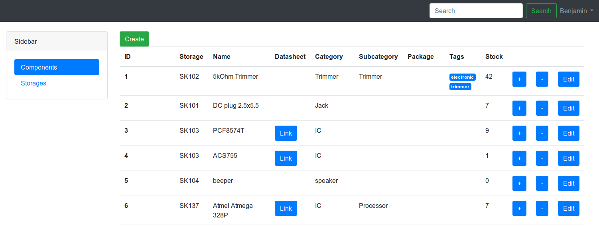

# Parts Manager



## Description

This software is a very simple way to manage your (electronic) parts. It supports storage locations and components which are attached to those storage locations. A component entry features multiple specifications like category, datasheet hyperlink, supplier and so on. There's also the feature to have a component countable with a stock value or non countable.

## Installation

You can use this Software with a LAMP Stack, or much easier Docker. For the Docker way you just need to invoke following Docker command:
```
docker run -v /my/path/.env:/var/www/html/.env -p 80:80 berkutta/parts_manager
```

The recommended .env config file looks like following, change mysql credentials to our setup:
```
APP_KEY=base64:MGrJqE4HL/BZwwDPrxHarRJvJvj6SU1vz1D0oide7i8=

DB_CONNECTION=mysql
DB_HOST=host
DB_PORT=3306
DB_DATABASE=db
DB_USERNAME=user
DB_PASSWORD=pass
```

After the first run it's recommended to generate a new App Key. Enter the Docker Container Bash console for this and execute the following command:

```
php artisan key:generate
```

After the first run you also want to create a username in the database. Enter the Docker Container Bash console for this and enter the laravel tinker console:
```
php artisan tinker
```

Execute the following commands within the laravel tinker console. Modify them to your needs.

```
$user = new App\User();
$user->username = 'username';
$user->password = Hash::make('the-password-of-choice');
$user->name = 'name';
$user->email = 'the-email@example.com';
$user->save();
```

If you are also lazy like me I recommend to install watchtower on your system. The watchtower container checks every 5 minutes if a image of a running docker container on your system has a newer image available on docker hub. If there is a new one it downloads and restarts the container: [watchtower](https://github.com/v2tec/watchtower)

## History

I don't even know if it is a good idea to put this piece of software online. I started creating this software in 2015. As a little explanation, I had no idea on how PHP or even Web technologies work back then. So this piece of software is really just a pile of very bad code.

Beginning 2018 I have started implementing a very basic and at least as bad API to this software. I basically just copied over the Database access code from the main software file and added some mode switching via switch-case statement.

End 2018 I want to pull the Raspberry Pi out of service on which this software is running on. My plan is to still run this software on a Docker Container. Thus I had the chance to improve the software agan a little bit during the process of making this software Docker compatible.

Beginning 2019 I finally started to refactor this whole software to the Laravel PHP Framework. With this refactoring the software is now in a usuable state.
